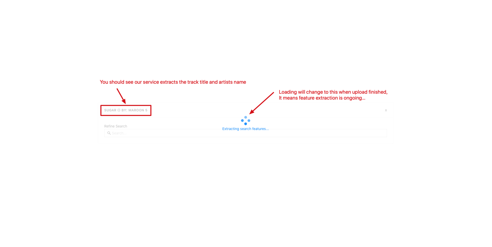

# Musiio Search: YouTube Link

This is a React sample on Musiio Search API for YouTube link upload.

## How to run?

In this example we will use `youtube-search-gui` as the project folder name

```
cd youtube-search-gui
npm install
npm start
```

Following the above commands, you should see this in your terminal:

```bash
Compiled successfully!

You can now view youtube-search-gui in the browser.

  Local:            http://localhost:3000
  On Your Network:  http://192.168.1.131:3000
  
Note that the development build is not optimized.
To create a production build, use npm run build.
```

You can then access the webpage demo using either of the links appeared above in your browser, in our case here, they are:

```
Local:            http://localhost:3000
On Your Network:  http://192.168.1.131:3000
```

## User Journey

You should see this page:


* Key in your API key followed by YouTube video link

* For YouTube link, video link or shortened url is accepted (see the following):

  ```
  https://www.youtube.com/watch?v=09R8_2nJtjg
  https://youtu.be/09R8_2nJtjg
  ```

* Press 'Enter' to submit your search request

* Wait for it to finish processing as shown below





* After successfully being processed, you should see your default search results as follows:


* You can perform refined search by inputting in the search box and hit 'Enter' to search:

